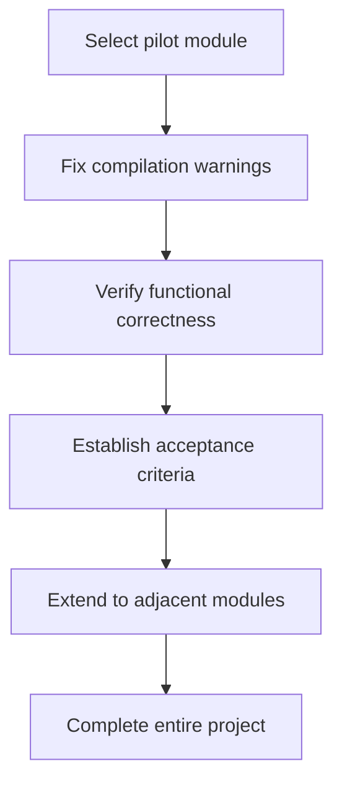

# Frequently Asked Questions (FAQ)

## Installation and Configuration

### Q1: What are the prerequisites for installing VuReact?

**A:** The following conditions must be met:

- Node.js 18.0.0 or higher
- An existing Vue 3 project (using `<script setup>` syntax)
- Package manager: npm, yarn, or pnpm

### Q2: How to verify a successful installation?

**A:** Run the following command to check the version:

```bash
npx vureact --version
```

If the version number is displayed, the installation is successful.

### Q3: Where should the configuration file be placed?

**A:** The configuration file `vureact.config.js` should be placed in the project root directory, at the same level as `package.json`.

### Q4: How to configure multiple environments (development/production)?

**A:** Environment variables can be used in the configuration file:

```javascript
import { defineConfig } from '@vureact/compiler-core';

export default defineConfig({
  input: 'src',
  exclude: ['src/main.ts'],
  output: {
    workspace: '.vureact',
    outDir: process.env.NODE_ENV === 'production' ? 'dist' : 'dev',
    bootstrapVite: true,
  },
  format: {
    enabled: process.env.NODE_ENV === 'production',
  },
});
```

## Compilation and Transformation

### Q1: Why do Hook rule errors occur during compilation?

**A:** This is usually because Vue reactive APIs are not called at the top level. Please check:

```vue
<!-- ❌ Error example: called inside conditional statement -->
<script setup>
if (condition) {
  const count = ref(0); // Error occurs here
}
</script>

<!-- ✅ Correct example: called at the top level -->
<script setup>
const count = ref(0); // Defined at the top level

if (condition) {
  // count can be used here
}
</script>
```

### Q2: How to exclude specific files or directories?

**A:** Use the `exclude` option in the configuration:

```javascript
export default defineConfig({
  input: 'src',
  exclude: [
    'src/main.ts', // Exclude entry file
    'src/legacy/**', // Exclude legacy code directory
    '**/*.test.vue', // Exclude test files
    '**/node_modules/**', // Exclude node_modules
  ],
});
```

### Q3: Where are the compiled files located?

**A:** Default output directory structure:

```txt
Project root/
├── .vureact/              # Workspace
│   ├── dist/              # Generated React code
│   │   ├── src/          # Transformed source code
│   │   ├── package.json  # React project configuration
│   │   └── vite.config.ts
│   └── cache/            # Compilation cache
└── src/                  # Original Vue code
```

### Q4: How to clear the compilation cache?

**A:** Delete the workspace directory:

```bash
# Delete the entire workspace
rm -rf .vureact

# Or delete only the cache
rm -rf .vureact/cache
```

### Q5: How to skip processing non-CSS styles?

**A:** Add the compiler option `preprocessStyles: false` to output the corresponding style code and files as-is.

### Q6: Why does scoped not work after disabling preprocessing for non-CSS styles?

**A:** Parsing of non-CSS code is not currently supported, so processing of scoped is ignored.

## Migration Strategy

### Q1: Why is it not recommended to migrate the entire project at once?

**A:** Migrating everything at once carries high risks:

1. **Difficult to verify**: With a large amount of code converted simultaneously, it's hard to verify correctness one by one.
2. **Difficult to rollback**: If issues arise, the entire migration needs to be reverted.
3. **Team pressure**: Business development must be paused for the migration.

**Recommended approach:**



### Q2: How to select a pilot module?

**A:** Criteria for selecting a pilot module:

1. **Clear boundaries**: Independent functionality with simple dependencies.
2. **Moderate complexity**: Not the simplest nor the most complex.
3. **Business value**: Has actual business value to validate real scenarios.
4. **Team familiarity**: The development team is familiar with the module's business logic.

### Q3: How to continue business development during migration?

**A:** A branch strategy is recommended:

```txt
Main branch (main)
    ├── Continue business development
    └── Merge to migration branch regularly

Migration branch (migration)
    ├── Perform VuReact conversion
    ├── Verify functional correctness
    └── Sync from main branch regularly
```

## Performance and Optimization

### Q1: What is the performance of the generated React code?

**A:** Code generated by VuReact is optimized:

1. **Low runtime overhead**: The adaptation layer is carefully designed with minimal performance cost.
2. **Follows React best practices**: Uses `memo`, `useCallback`, etc., for optimization.
3. **Good code readability**: Generated code is clear and easy to read, facilitating subsequent optimization.

### Q2: How to reduce compilation time?

**A:** The following measures can be taken:

1. **Use caching**: VuReact automatically caches compilation results.
2. **Incremental compilation**: Only compile modified files.
3. **Exclude unnecessary files**: Configure the `exclude` option appropriately.
4. **Modular compilation**: Compile core modules first, then expand gradually.

## Error Handling

### Q1: What to do when encountering compilation errors?

**A:** Troubleshoot by following these steps:

1. **Check error messages**: Error messages indicate the specific file and line number.
2. **Verify code conventions**: Ensure code complies with [compilation conventions](./specification).
3. **Simplify reproduction**: Create a minimal reproducible code snippet.

### Q2: How to report a bug?

**A:** Please provide the following information:

1. **VuReact version**: `npx vureact --version`
2. **Node.js version**: `node --version`
3. **Reproduction steps**: Detailed description of how to reproduce the issue.
4. **Error message**: Complete error stack trace.
5. **Relevant code**: Minimal reproducible code snippet.

Issues can be submitted at [GitHub Issues](https://github.com/vureact-js/core/issues).

## Feature Support

### Q1: Which Vue 3 features does VuReact support?

**A:** Full support for script setup, Composition API, defineProps/defineEmits/defineSlots, watch/computed, and other core features.

For detailed support status, please refer to the [Capability Matrix](./capabilities-overview).

### Q2: What is the performance of the converted code?

**A:** Through compile-time optimization and a zero-runtime styling solution, the converted React code is close to handwritten code by humans, and the application performance is comparable to native React applications.

### Q3: Is Vue 2 or Options API supported?

**A:** The current version focuses on Vue 3 + Composition API and is not recommended for Vue 2 or Options API projects.

### Q4: How to debug the converted code?

**A:** Since it is a source-to-source conversion, you can run and debug the React application normally.

### Q5: Why are some Vue APIs not adapted?

**A:** The compiler adopts a **targeted identification strategy** instead of fully covering all Vue APIs:

1. Scope locking mechanism: The compiler maintains a **clear scope of API adaptation** ([Capability Matrix Overview](/guide/capabilities-overview)) and only processes Vue APIs that are known and have implemented adaptations.

2. Selective adaptation principles:
   - **Core API priority**: Prioritize adapting Vue 3's core reactive APIs and lifecycle hooks.
   - **High-frequency usage priority**: Determine adaptation priority based on actual project usage frequency.
   - **Semantic convertibility priority**: Only adapt APIs whose semantics can be directly mapped to React concepts.

3. Handling of unprocessed code:
   - **Preserved as-is**: Calls to Vue APIs outside the adaptation scope are retained in the output code without modification.
   - **Runtime compatibility**: Some unprocessed APIs may still work in the React runtime environment (e.g., pure utility functions).
   - **Compile-time warnings**: For obviously incompatible APIs, the compiler issues warning prompts.

4. Extensibility design:
   - **Plugin mechanism**: Support extending the API adaptation scope through plugins.
   - **Progressive adaptation**: New API adaptations can be added gradually according to project needs.

### Q6: What are common types of unprocessed APIs?

**A:** Common types of unprocessed APIs include:

| Type                           | Examples                      | Reason                            | Recommendation                                              |
| ------------------------------ | ----------------------------- | --------------------------------- | ----------------------------------------------------------- |
| **Vue 2 Legacy APIs**          | `$set`, `$delete` ...         | Deprecated in Vue 3               | Migrate to Vue 3 reactive APIs                              |
| **Vue-specific Concepts**      | `$parent`, `$children` ...    | No equivalent in React            | Use Context or Props instead                                |
| **Complex Reactive Utilities** | `customRef`, `markRaw` ...    | High implementation complexity    | Implement manually or use React native solutions            |
| **Ecosystem-specific**         | `$store` (Vuex), `$pinia` ... | Requires specific runtime support | Use corresponding React state management libraries directly |

### Q7: What handling strategies are recommended for unprocessed APIs?

**A:** The following strategies are recommended:

1. **Code review**: Focus on unprocessed Vue API calls during migration.
2. **Progressive migration**: Migrate core logic first, then handle edge cases gradually.
3. **Alternative solutions**: Find corresponding solutions in the React ecosystem for unprocessed APIs.
4. **Contribute extensions**: If specific API adaptation is needed, extend the compiler's capabilities through the plugin mechanism.

### Q8: Why do the generated React component names differ from those in Vue?

**A:** Use the special comment `// @vr-name: ComponentName` or the `name` option in `defineOptions` to explicitly tell the compiler the component name.

### Q9: How to handle Vue Router?

**A:** Router conversion provides the [VuReact Router](https://router-vureact.vercel.app/guide/introduction.html) adaptation package, which the compiler will process, but entry configuration and other parts need manual fine-tuning because:

1. **Project context**: Router configuration involves project structure.
2. **Syntax differences**: Component usage in router configuration needs to be rewritten using JSX Element syntax.

For detailed migration guidelines, please refer to [Router Adaptation](./router-adaptation).

### Q10: Is TypeScript supported?

**A:** ✅ TypeScript is fully supported. VuReact will:

1. Preserve original type definitions.
2. Generate correct TypeScript types.
3. Output `tsconfig.json` configuration.

### Q11: How to handle third-party Vue libraries?

**A:** Handle on a case-by-case basis:

1. **Pure utility libraries**: Can usually be used directly.
2. **UI component libraries**: Need to find corresponding React versions or alternatives.
3. **Vue-specific libraries**: Need to be rewritten or replaced with alternatives.

It is recommended to evaluate alternatives for third-party libraries before migration.

## Advanced Questions

### Q1: Can custom transformation rules be defined?

**A:** ✅ Customization is supported through the plugin system:

```javascript
export default defineConfig({
  plugins: {
    // Parser phase plugins
    parser: {
      // Custom parsing logic
    },
    // Transformer phase plugins
    transformer: {
      // Custom transformation logic
    },
    // Code generation phase plugins
    codegen: {
      // Custom generation logic
    },
  },
});
```

### Q2: How to maintain the project after migration is completed?

**A:** After the migration is completed:

1. **Maintain it like a regular React project**: You can use all React ecosystem tools (such as React DevTools, ESLint React plugins, React Testing Library, etc.), without relying on VuReact-related compilation tools.
2. **Continuous optimization is possible**: The generated React code remains readable and can be manually optimized based on React best practices (e.g., adjusting component splitting, optimizing Hooks usage, adding performance caching strategies, etc.).
3. **Modification rollback is allowed**: If there are minor issues with the generated code, you can directly edit the React code, but note that:
   - If you need to re-run VuReact compilation later, manually modified code will be overwritten. It is recommended to exclude the corresponding files from the compilation process after modification (via the `exclude` configuration).
   - For important modifications, it is advisable to synchronize them back to the original Vue code (if dual-end code needs to be retained), or completely disable the VuReact compilation process.
4. **VuReact can be upgraded**: If recompilation is needed later (e.g., the original Vue code has iterations), upgrading VuReact to the latest version can get better conversion logic, more API adaptation support, and reduce the cost of manual adjustment.
5. **Version management recommendations**:

   ```txt
   # Recommended git commit specification
   - feat(react): Optimize Hooks usage of XX component
   - fix(react): Fix event binding logic of XX component
   - chore(vureact): Upgrade VuReact to vx.x.x and recompile
   ```

### Q3: Are there community or support channels?

**A:** Yes, you can get support through the following channels:

1. **GitHub Discussions**: Technical discussions and Q&A [GitHub Discussions](https://github.com/vureact-js/core/discussions)
2. **GitHub**: Bug reports and feature requests [GitHub Issues](https://github.com/vureact-js/core/issues)
3. **Documentation**: Detailed [Usage Guide](/guide/introduction)
4. **Example projects**: Refer to [Sample Code](https://gitee.com/vureact-js/core/tree/master/packages/compiler-core/examples)
5. **Sponsorship**: Support the author! [Afadian](https://afdian.com/a/vureact-js/plan)

---

**Didn't find an answer?** Please check the complete documentation or submit a new issue [GitHub Issues](https://github.com/vureact-js/core/issues).
