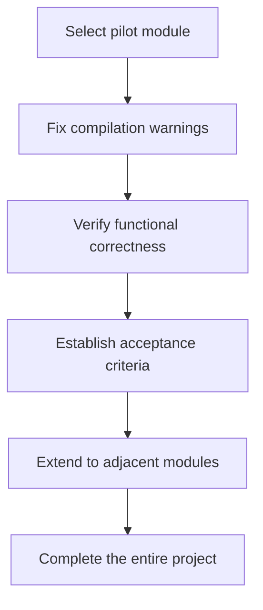

# Frequently Asked Questions (FAQ)

## Q1: What are the prerequisites for installing VuReact?

**A:** The following conditions must be met:

- Node.js 18.0.0 or higher
- An existing Vue 3.x project (using `<script setup>` syntax)
- Package manager: npm, yarn, or pnpm

## Q2: How to verify if the installation is successful?

**A:** Run the following command to check the version:

```bash
npx vureact --version
```

If the version number is displayed, the installation is successful.

## Q3: Where should the configuration file be placed?

**A:** The configuration file `vureact.config.js` should be placed in the project root directory, at the same level as `package.json`.

## Q4: How to configure multiple environments (development/production)?

**A:** Environment variables can be used in the configuration file:

```javascript
import { defineConfig } from '@vureact/compiler-core';

export default defineConfig({
  output: {
    outDir: process.env.NODE_ENV === 'production' ? 'react-app' : 'dev',
  },
  format: {
    enabled: process.env.NODE_ENV === 'production',
  },
});
```

## Q5: Why is a Hook rule error reported during compilation?

**A:** This usually happens because Vue reactive APIs are not called at the top level. Please check:

```vue
<!-- ❌ Error example: Called inside a conditional statement -->
<script setup>
if (condition) {
  const count = ref(0); // Error will occur here
}
</script>

<!-- ✅ Correct example: Called at the top level -->
<script setup>
const count = ref(0); // Defined at the top level

if (condition) {
  // count can be used here
}
</script>
```

## Q6: How to exclude specific files or directories?

**A:** Use the `exclude` option in the configuration:

```javascript
export default defineConfig({
  input: 'src',
  exclude: [
    'src/main.ts', // Exclude entry file
    'src/legacy/**', // Exclude legacy code directory
    '**/*.test.vue', // Exclude test files
  ],
});
```

## Q7: Where are the compiled files located?

**A:** Default output directory structure:

```txt
Project root/
├── .vureact/             # Workspace
│   ├── react-app/        # Generated React code
│   │   ├── src/          # Transformed source code
│   │   ├── package.json  # React project configuration
│   │   └── vite.config.ts
│   └── cache/            # Compilation cache
└── src/                  # Original Vue code
```

## Q8: How to clear the compilation cache?

**A:** Delete the workspace directory:

```bash
# Delete the entire workspace
rm -rf .vureact

# Or delete only the cache
rm -rf .vureact/cache
```

## Q9: How to skip processing non-CSS styles?

**A:** Add the compiler option `preprocessStyles: false` to output the corresponding style code and files as-is.

## Q10: Why does scoped not work after disabling preprocessing for non-CSS styles?

**A:** Parsing of non-CSS code is not supported at present, so processing of scoped is ignored.

## Q11: Why is it not recommended to migrate the entire project at once?

**A:** Migrating all at once carries high risks:

1. **Difficult to verify**: With a large amount of code converted simultaneously, it's hard to verify correctness one by one.
2. **Difficult to rollback**: If problems occur, the entire migration needs to be reverted.
3. **Team pressure**: Business development needs to be paused for migration.

**Recommended approach:**



## Q12: How to select a pilot module?

**A:** Criteria for selecting a pilot module:

1. **Clear boundaries**: Independent functionality with simple dependencies.
2. **Moderate complexity**: Not the simplest nor the most complex.
3. **Business value**: Has actual business value to validate real scenarios.
4. **Team familiarity**: The development team is familiar with the business logic of the module.

## Q13: How to continue business development during migration?

**A:** It is recommended to adopt a branch strategy:

```txt
Main branch (main)
    ├── Continue business development
    └── Merge to migration branch regularly

Migration branch (migration)
    ├── Perform VuReact conversion
    ├── Verify functional correctness
    └── Sync from main branch regularly
```

## Q14: What is the performance of the generated React code?

**A:** The code generated by VuReact is optimized:

1. **Low runtime overhead**: The adaptation layer is carefully designed with minimal performance overhead.
2. **Compliant with React best practices**: Uses `memo`, `useCallback`, etc., for optimization.
3. **Good code readability**: The generated code is clear and easy to read, facilitating subsequent optimization.

## Q15: How to reduce compilation time?

**A:** The following measures can be taken:

1. **Use caching**: VuReact automatically caches compilation results.
2. **Incremental compilation**: Only compile modified files.
3. **Exclude unnecessary files**: Configure the `exclude` option appropriately.
4. **Module-by-module compilation**: Compile core modules first, then expand gradually.

## Q16: What to do when encountering compilation errors?

**A:** Troubleshoot by following these steps:

1. **Check error messages**: Error messages will indicate the specific file and line number.
2. **Check code conventions**: Ensure the code complies with the [compilation conventions](./specification).
3. **Simplify reproduction**: Create a minimal reproducible code snippet.

## Q17: How to report a Bug?

**A:** Please provide the following information:

1. **VuReact version**: `npx vureact --version`
2. **Node.js version**: `node --version`
3. **Reproduction steps**: Describe in detail how to reproduce the issue.
4. **Error message**: Complete error stack trace.
5. **Relevant code**: Minimal reproducible code snippet.

Issues can be submitted at [GitHub Issues](https://github.com/vureact-js/core/issues).

## Q18: Which Vue 3 features does VuReact support?

**A:** Fully supports core features such as script setup, Composition API, defineProps/defineEmits/defineSlots, watch/computed, etc.

For detailed support status, please refer to the [Capability Matrix](./capabilities-overview).

## Q19: What is the performance after conversion?

**A:** Through compile-time optimization and a zero-runtime style solution, the converted React code is close to handwritten code by humans, and the application performance is comparable to native React applications.

## Q20: Does it support Vue 2 or Options API?

**A:** The current version focuses on Vue 3 + Composition API and is not recommended for Vue 2 or Options API projects.

## Q21: How to debug the converted code?

**A:** Since it is a source-to-source level conversion, you can run and debug the React application normally.

## Q22: Why are some Vue APIs not adapted?

**A:** The compiler adopts a **targeted identification strategy** instead of fully covering all Vue APIs:

1. Scope locking mechanism: The compiler maintains a **clear scope of API adaptation** ([Capability Matrix Overview](/guide/capabilities-overview)) and only processes Vue APIs that are known and have implemented adaptations.

2. Selective adaptation principles:
   - **Core API first**: Prioritize adapting Vue 3's core reactive APIs and lifecycle hooks.
   - **High-frequency usage first**: Determine adaptation priorities based on actual project usage frequency.
   - **Semantically convertible first**: Only adapt APIs whose semantics can be directly mapped to React concepts.

3. Handling of unprocessed code:
   - **Retained as-is**: Calls to Vue APIs outside the adaptation scope are retained in the output code as-is.
   - **Runtime compatibility**: Some unprocessed APIs may still work in the React runtime environment (e.g., pure utility functions).
   - **Compile-time warnings**: For obviously incompatible APIs, the compiler will issue warning prompts.

4. Extensibility design:
   - **Plugin mechanism**: Support extending the API adaptation scope through plugins.
   - **Progressive adaptation**: New API adaptations can be added gradually according to project needs.

## Q23: What are the common types of unprocessed APIs?

**A:** Common types of unprocessed APIs include:

| Type                           | Example                       | Reason                             | Suggestion                                                  |
| ------------------------------ | ----------------------------- | ---------------------------------- | ----------------------------------------------------------- |
| **Vue 2 Legacy APIs**          | `$set`, `$delete` ...         | Deprecated in Vue 3                | Migrate to Vue 3 reactive APIs                              |
| **Vue-specific Concepts**      | `$parent`, `$children` ...    | No corresponding concepts in React | Use Context or Props instead                                |
| **Complex Reactive Utilities** | `customRef`, `markRaw` ...    | High implementation complexity     | Implement manually or use React native solutions            |
| **Ecosystem-specific**         | `$store` (Vuex), `$pinia` ... | Requires specific runtime support  | Use corresponding React state management libraries directly |

## Q24: What are the recommended handling strategies for unprocessed APIs?

**A:** The following strategies are recommended:

1. **Code review**: Focus on unprocessed Vue API calls during migration.
2. **Progressive migration**: Migrate core logic first, then handle edge cases gradually.
3. **Alternative solutions**: Find corresponding solutions in the React ecosystem for unprocessed APIs.
4. **Contribute extensions**: If there is a need for specific API adaptation, extend the compiler capabilities through the plugin mechanism.

## Q25: Why is the generated React component name inconsistent with that in Vue?

**A:** Use the special comment `// @vr-name: ComponentName` or the `name` option of `defineOptions` to explicitly tell the compiler the component name.

## Q26: How to handle Vue Router?

**A:** Router conversion provides the [VuReact Router](https://router.vureact.top/guide/introduction.html) adaptation package, which will be processed by the compiler, but entry configuration and other parts need manual fine-tuning because:

1. **Project context**: Routing configuration involves project structure.
2. **Syntax differences**: The use of components in routing configuration needs to be changed to JSX Element syntax.

For detailed migration guidelines, please refer to [Router Adaptation](./router-adaptation).

## Q27: Does it support TypeScript?

**A:** ✅ Fully supports TypeScript. VuReact will:

1. Preserve original type definitions.
2. Generate correct TypeScript types.
3. Output `tsconfig.json` configuration.

## Q28: How to handle third-party Vue libraries?

**A:** Handle in different cases:

1. **Pure utility libraries**: Can usually be used directly.
2. **UI component libraries**: Need to find corresponding React versions or alternatives.
3. **Vue-specific libraries**: Need to be rewritten or find alternatives.

It is recommended to evaluate alternatives for third-party libraries before migration.

## Q29: Can custom conversion rules be defined?

**A:** ✅ Supported through the plugin system:

```javascript
export default defineConfig({
  plugins: {
    // Parser phase plugin
    parser: {
      // Custom parsing logic
    },
    // Transformer phase plugin
    transformer: {
      // Custom transformation logic
    },
    // Code generation phase plugin
    codegen: {
      // Custom generation logic
    },
  },
});
```

## Q30: What to do if ESLint / TypeScript reports errors?

**A:** Resolve by following these steps:

1. **Error cause**: The adaptation Hooks provided by `@vureact/runtime-core` may be incompatible with ESLint's existing React Hook rules. Note that the internal implementation of these Hooks fully complies with React specifications and does not affect actual operation.

2. **Solutions**:
   - **Ignore errors**: These ESLint warnings can be safely ignored.
   - **Disable detection**: Turn off relevant rules (e.g., `react-hooks/exhaustive-deps`) in the ESLint configuration.
   - **TypeScript compilation**: If running the `tsc -b` command reports errors, it is recommended to use other build commands (e.g., `vite build`).

## Q31: How to maintain after migration is completed?

**A:** After migration is completed:

1. **Maintain like a normal React project**: All React ecosystem tools can be used.
2. **Continuous optimization**: The generated code can be manually optimized.
3. **Rollback modifications**: If needed, the generated React code can be edited directly, but care should be taken to avoid overwriting by subsequent compilations.
4. **Upgrade VuReact**: New versions may provide better conversion effects.

## Q32: What to do if an error occurs when accessing routes?

**A:** For common issues related to route conversion, please refer to the [FAQ section of the Router Adaptation chapter](/en/guide/router-adaptation#FAQ).

## Q33: Is there a community or support channel?

**A:** Yes, support can be obtained through the following channels:

1. **GitHub Discussions**: Technical discussions and Q&A [GitHub Discussions](https://github.com/vureact-js/core/discussions)
2. **GitHub**: Bug reports and feature requests [GitHub Issues](https://github.com/vureact-js/core/issues)
3. **Documentation**: Detailed [User Guide](/en/guide/introduction)
4. **Example projects**: Refer to [sample code](https://gitee.com/vureact-js/core/tree/master/packages/compiler-core/examples)
5. **Sponsorship**: Support the author! [Afadian](https://afdian.com/a/vureact-js/plan)

---

**Didn't find an answer?** Please check the complete documentation or submit a new issue [GitHub Issues](https://github.com/vureact-js/core/issues).
