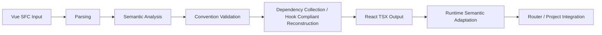

# Philosophy

The design of VuReact does not revolve around "how to rewrite Vue syntax into React syntax." Instead, it is centered on a more fundamental question: **How can Vue code be stably established in React.**

Therefore, VuReact's goal is not to become a "universal converter" capable of handling any legacy code, but rather to provide a cross-framework engineering path that is **analyzable, predictable, maintainable, and incrementally adoptable.** The principles below define VuReact's behavioral boundaries and explain why it adopts the current collaborative architecture of Compiler, Runtime, and Router.

## 1. Controllability over Full Coverage

**Principle**: It is better to explicitly reject unanalyzable code than to generate unmaintainable React output.

The difficulty of migrating from Vue to React usually lies not in surface-level syntax, but in the reconstruction of reactive semantics, lifecycle, dependency relationships, and component boundaries. React Hook rules require that the generated output must satisfy strict static analysis prerequisites; if the input code itself is unanalyzable, the compiler cannot stably produce output that conforms to the rules.

Therefore, VuReact proactively requires that the input code adheres to clear conventions, such as:

- Based on Vue 3 and `<script setup>`
- Reactive APIs are called at the top level
- Template expressions are statically analyzable
- Component boundaries are clearly declared

The direct benefits of this design are:

- Problems surface at compile time, not at runtime
- Teams can clearly distinguish between "migratable scope" and "code that needs prior cleanup"
- Similar inputs yield consistent outputs more easily, facilitating ongoing maintenance and automated verification

## 2. Semantics over Syntax

**Principle**: The focus of conversion is not "to look like React," but "to preserve correct semantics in React."

VuReact takes a semantic compilation approach. It does not mechanically replace code based on syntactic form alone. Instead, it first understands the reactive sources, data flow direction, component interfaces, and dependency relationships in the code, and then decides what structure to generate.

Take `ref` as an example. Mechanical replacement can easily produce results that "look syntactically like React but have already changed semantically":

```vue
<script setup lang="ts">
import { ref } from 'vue';

const count = ref(0);
const inc = () => count.value++;
</script>
```

If only surface-level replacement is performed, the result might look like:

```tsx
const [count, setCount] = useState(0);
const inc = () => count++;
```

This does not preserve the behavioral semantics of Vue's `ref`. VuReact's reconstruction goal is closer to the following structure:

```tsx
const count = useVRef(0);
const inc = useCallback(() => {
  count.value++;
}, [count.value]);
```

The key point here is not which Hook `ref` has been replaced by, but rather:

- `count` is recognized as a reactive source
- `inc` is recognized as a top-level callback target
- The dependency relationships within the callback can be collected and reconstructed

This is also the value of VuReact's automated dependency analysis. It does not simply "put variables into a dependency array"; rather, it triggers analysis around a clear reconstruction target, then collects dependencies along reference chains, aliases, and destructuring relationships, thereby generating more stable React structures.

## 3. Conventions as a Collaboration Interface

**Principle**: Clear conventions are more valuable than complex runtime fallbacks.

VuReact's conventions are not solely about making the compiler "easier to implement." More importantly, they help teams form a shared understanding of migration boundaries. For cross-framework migration, conventions themselves serve as a collaboration interface:

- Developers know which coding styles are more stable and favorable for conversion
- Reviewers know which issues constitute convention violations
- Teams can incorporate these conventions into code review and CI rules

For example, `defineProps`, `defineEmits`, and `defineExpose` in Vue describe the input, output, and exposure boundaries of a component. VuReact does not preserve these macros themselves but instead reconstructs them into more natural interface forms in React:

```vue
<script setup lang="ts">
const props = defineProps<{ title: string }>();
const emit = defineEmits<{ (e: 'save', id: number): void }>();
const count = ref(0);

defineExpose({ count });
</script>
```

The corresponding React form would typically be close to:

```tsx
type IComponentProps = {
  title: string;
  onSave?: (id: number) => void;
};

const Component = memo(
  forwardRef<any, IComponentProps>((props, expose) => {
    const count = useVRef(0);

    useImperativeHandle(expose, () => ({ count }));

    return null;
  }),
);
```

What is preserved here is not the macro call form, but the component boundary semantics:

- `defineProps` → Input contract
- `defineEmits` → Output callback protocol
- `defineExpose` → Exposed capability boundary

## 4. Compile-time and Runtime Synergy

**Principle**: What can be determined at compile time should be resolved there; what must preserve runtime semantics should be handled by the Runtime.

VuReact's overall processing pipeline can be summarized as:



Within this pipeline:

- **Compiler** is responsible for parsing Vue SFCs, understanding template and script semantics, validating conventions, reconstructing dependency-driven structures, and outputting code that closely follows React engineering practices.
- **Runtime** provides semantic adaptation capabilities such as `useVRef` and `useComputed`, handling framework differences that cannot be fully resolved at compile time.
- **Router** offers adaptation capabilities for Vue Router-style routing when needed, extending the migration path to the full project.

This layering serves three purposes:

- Digest as much uncertainty as possible at compile time
- Limit runtime responsibilities to the necessary and limited scope of semantic adaptation
- Keep the generated output readable and maintainable as native React code

Therefore, VuReact is neither a pure string replacement tool nor a bridge solution reliant on large-scale runtime interpretation.

## 5. Gradual Evolution, Not Big Bang

**Principle**: Migration should be completed through controllable, incremental iterations rather than a one-time rewrite.

VuReact's recommended approach is not to "translate" the entire Vue project into React at once, but to first establish a stable closed loop, then gradually expand scope by page, directory, or business module. This method is better suited for real-world projects and more conducive to team collaboration.


The value of gradual migration is主要体现在:

- Risk is partitioned by module rather than concentrated in a single event
- Each step can define acceptance criteria and rollback plans
- Compilation warnings, fix patterns, and success stories can progressively become team standards
- Vue source code can remain the primary maintenance target, while React output serves as the compilation result for verification

This is also why VuReact is more suitable for integration into engineering workflows, rather than being used as a one-time code processing tool.

## 6. What These Principles Mean

When taken together, the above principles clarify VuReact's positioning:

- It focuses on **software engineering controllability**, not just the speed of syntactic rewriting
- It emphasizes **semantic reconstruction**, not just surface-level code mapping
- It provides a **verifiable migration path**, not just a one-time transformation result

Therefore, VuReact's value is first and foremost reflected at the engineering level: helping teams establish stable boundaries, define clear rules, control risks, and continuously produce maintainable React code during cross-framework evolution.
