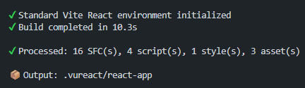
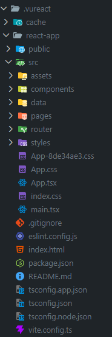
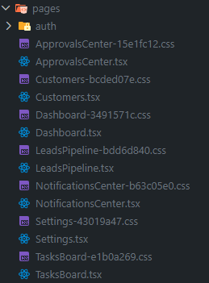
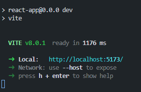
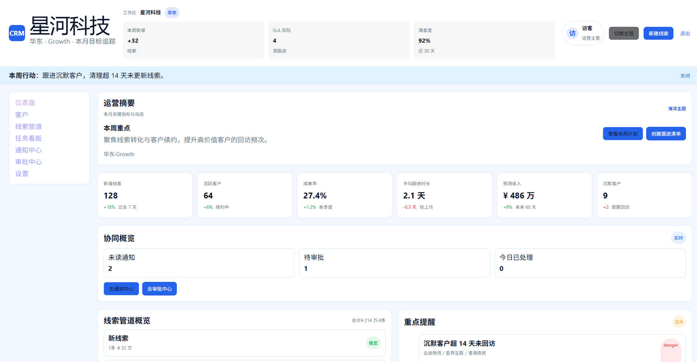

# 客户关系管理后台

客户关系管理后台 Vue 项目迁移实战。

## 概述

这是一篇可跟练的迁移教程，目标是让你基于 `Vue3 + Vite + Vue Router` 项目，独立完成一次 VuReact 迁移闭环。

同时，VuReact 不仅支持处理 SFC 文件，还支持处理独立的 Script 和 Style 文件，并自动拷贝静态资产文件。

适用读者：

1. 已经在维护 Vue 3 业务项目，希望渐进式迁移到 React 生态。
2. 享受 Vue 优秀的心智模型并编写 React。
3. 体验真正的跨框架 Vue + React 混合开发，并产出 React 代码。

在开始之前，你可以提前访问本教程的 [在线演示](https://codesandbox.io/p/github/vureact-js/example-crm-admin-backend/master) 进行 [预览](https://r862dm-5173.csb.app) 和体验。

## 学前检查

### 适用场景

- 你的项目使用 Vue3（含 `<script setup>`）。
- 你接受“可控迁移”，而不是“一键零修改全自动”。
- 你希望先跑通一个真实案例，再迁移自己的业务仓。
- 你正计划 **与编程 AI 协作**，将 Vue 项目迁移至 React（`推荐`）。

### 能力边界（请先确认）

- 路由支持自动适配，但在部分项目结构下仍需人工校正入口与路由文件。
- 迁移目标是“可运行、可维护、可继续演进”，不是“逐字符无差异”。
- 未支持的 API 或类型接口会保持原样迁移到 React 产物中。
- 示例覆盖常见后台场景，但不包含后端接口和权限平台的完整对接，仅使用模拟接口。

### 准备项

- Node.js 19+
- npm 9+
- 已克隆 [crm-admin-backend](https://github.com/vureact-js/example-crm-admin-backend) 仓并安装依赖

## Step 1：准备示例与配置

### 命令

```bash
cd crm-admin-backend
npm install
```

### 你会看到什么

- 依赖安装完成，项目目录中 `package.json` 可执行 `vr:build`。

```json
"scripts": {
  "vr:watch": "vureact watch",
  "vr:build": "vureact build"
}
```

- 根目录存在 `vureact.config.ts` 与 `src/`。

### 失败时检查

- `npm` 命令不可用：检查 Node/npm 安装。
- 安装失败：优先清理锁文件冲突后重试。
- 不会解决：复制错误并求助于 AI。

### 通过标准

- `npm install` 无阻塞性错误。

## Step 2：执行 VuReact 编译

### 命令

```bash
npm run vr:build
```

### 你会看到什么

- 控制台输出编译统计（SFC/script/style 处理数量）。



- 生成 `.vureact/react-app` 目录，且与 Vue 源结构一致。

<div style="display: flex;">
  <div style="font-size: 14px; text-align: center;">
    
    <p>(Vue 目录)</p>
  </div>
 <div style="font-size: 14px; text-align: center; margin-left: 46px">
    
    <p>(.vureact 目录)</p>
 </div>
</div>

- 若有 warning，会显示具体文件位置。

### 失败时检查

- Npm/Network 错误：检查当前是否联网。
- SFC 语法错误：先修复源 Vue 文件再编译。
- 路由相关告警：继续执行 [Step 3](#step-3-处理路由接入-关键) 进行路由接入校正。

### 通过标准

- 输出目录存在且包含 `src/main.tsx`、`src/router` 等 React 工程文件。

## Step 3：处理路由接入（关键）

> 详细背景请阅读：[路由适配指南](/guide/router-adaptation)

### 命令

```bash
cd .vureact/react-app
npm install
```

如需手动校正，重点检查：

- `src/main.tsx` 是否渲染 `<router.RouterProvider />`
- 路由配置是否从 `@vureact/router` 导入

### 你会看到什么

- 应用入口统一由 `RouterProvider` 承载：

```tsx
// src/main.tsx
import RouterInstance from './router/index';

createRoot(document.getElementById('root')!).render(
  <StrictMode>
    <RouterInstance.RouterProvider />
  </StrictMode>,
);
```

- 路由 `'vue-router'` 导入被替换为 `'@vureact/router'`：

```ts
// src/router/index.ts
import { createRouter, createWebHashHistory } from '@vureact/router';
import { isAuthed } from '../data/mock-api';
import routes from './routes';

const router = createRouter({ history: createWebHashHistory(), routes });

router.beforeEach((to, _from, next) => {
  if (to.meta.public) {
    next();
    return;
  }
  if (!isAuthed()) {
    next({ name: 'login', query: { redirect: to.fullPath } });
    return;
  }
  next();
});

export default router;
```

- 页面路由（如 Dashboard/Customers/Leads/Tasks 等）可被访问。



### 失败时检查

- 页面空白：通常是 `main.tsx` 仍直接渲染 `<App />`。
- 路由组件报错：检查 `router/index` 导出是否正确。
- 仍不通：按路由适配文档的“手动适配方案”逐项对照。

### 通过标准

- 启动后可以正常切换路由，不出现全局白屏。

## Step 4：启动 React 产物

### 命令

```bash
npm run dev
```

### 你会看到什么

- Vite dev server 启动成功（默认本地端口）。



- 浏览器打开后进入登录页，再进入 CRM 主界面。



### 失败时检查

- 缺依赖：安装日志里补齐缺失包后重启。
- TS 报错：优先检查路由入口与导入路径。
- Vite 报错：优先检查当前 Node.js 版本是否兼容 Vite 8.x。
- 检查是否可升级最新版本 VuReact。

### 通过标准

- React 产物可访问、可热更新、无阻塞性启动错误。
- 修改 Vue 源文件 React 产物与页面同步更新。

## Step 5：页面验收（业务闭环）

在运行中的页面手动验收以下路径。

### 你会看到什么

- 通知中心：筛选、关键词、单条处理、全部已读。
- 审批中心：发起审批、通过/驳回、审批历史可追踪。
- 线索管道：高价值线索触发审批联动。
- 任务看板：任务进入阻塞触发协同通知。
- 仪表盘：协同摘要（未读/待审批/今日处理）联动更新。

### 失败时检查

- 联动不触发：检查 `mock-api` 中规则入口是否被页面调用。
- 数据不刷新：检查页面 reload/watch 逻辑。

### 通过标准

- “线索/任务动作 -> 协同中心 -> 仪表盘摘要”链路完整跑通。

## Step 6：就近排错（按症状）

### 命令

```bash
# 重新编译
npm run vr:build

# 重新启动产物
cd .vureact/react-app && npm run dev

# 或删除产物后再重编译
rm .vureact
npm run vr:build
cd .vureact/react-app && npm install && npm run dev

```

### 你会看到什么

- 大多数问题可归类为：路由入口、依赖缺失、源文件语法、类型约束、版本不兼容。

### 失败时检查

- 路由空白：优先看 [Step 3](#step-3-处理路由接入-关键)。
- 编译失败：回到报错文件，修源代码后重编译。
- 类型不通过：检查生成产物中路由/运行时包导入是否正确，或不检查类型。

### 通过标准

- 能在 10 分钟内定位并修复常见阻塞错误。

## Step 7：迁移到你的业务仓（最小模板）

### 命令

- 在你的 Vue 项目安装编译器。

```bash
npm i -D @vureact/compiler-core
```

- 接着在项目根目录下创建配置文件。

```ts
// vureact.config.ts
import { defineConfig } from '@vureact/compiler-core';

// 最小化示例配置，可根据实际需求进行调整
export default defineConfig({
  input: 'src',
  exclude: ['src/main.ts'],
  output: {
    workspace: '.vureact',
    outDir: 'react-app',
    bootstrapVite: true,
  },
});
```

具体配置方法请参考 [配置 API](/api/config) 文档。

- 执行迁移。

```bash
npx vureact build

# 或指定编译某个目录（可选）
npx vureact build -i src/components

# 或指定编译某个文件（可选）
npx vureact build -i src/pages/Home.vue
```

### 你会看到什么

- 你的业务仓生成对应 React 产物目录。
- 可复用本教程的 [Step 3](#step-3-处理路由接入-关键)~[Step 6](#step-6-就近排错-按症状) 验收路径。

### 失败时检查

- 先缩小迁移范围（目录级渐进），不要一次性全仓推进。
- 遇到路由复杂场景，先走“手动适配”保证可运行。

### 通过标准

- 你的业务项目至少 1 条核心业务链路在 React 产物可运行。

## 附录 A：命令速查

```bash
# Vue 示例目录
cd crm-ops-portal
npm install
npm run vr:build

# React 产物目录
cd .vureact/react-app
npm install
npm run dev
```

## 附录 B：能力映射（本案例）

- 模板：覆盖常用指令和事件等
- 组件：`defineProps` / `defineEmits` / slot
- 脚本：`ref` / `computed` / `watch` 等
- 依赖注入：`provide` / `inject`
- 路由：`createRouter` / `router-link` / `router-view` 和守卫等
- 样式：`scoped` / Sass 语法

## 附录 C：排错索引

- 路由空白页：先看 [路由适配指南](/guide/router-adaptation)
- 语法覆盖范围：看 [能力矩阵](/guide/capabilities-overview)
- 编译告警处理建议：看 [最佳实践](/guide/best-practices)
- 问题反馈：
  - [Compiler Issues](https://github.com/vureact-js/core/issues)
  - [Router Issues](https://github.com/vureact-js/vureact-router/issues)

## 附录 D：继续学习导航

完成本教程后，建议按以下顺序继续：

1. [CLI 指南](/guide/cli)：掌握 `build/watch`、输入范围与工程化命令用法。
2. [配置 API](/api/config)：系统理解 `input/exclude/output/router` 等核心配置项。
3. [编译约定](/guide/specification)：明确编译器的行为边界与代码约定，降低迁移偏差。
4. [最佳实践](/guide/best-practices)：建立可回滚、可验收、可扩展的迁移流程。
