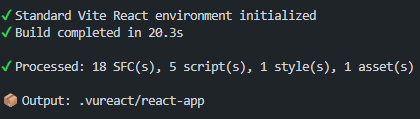
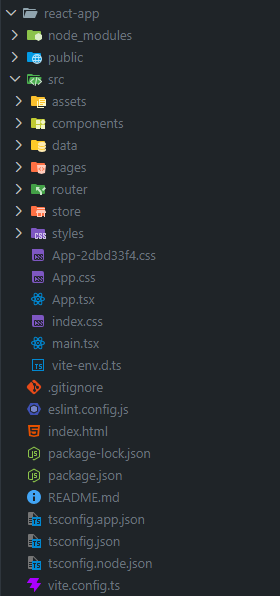
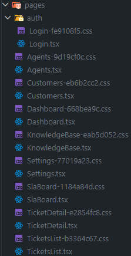
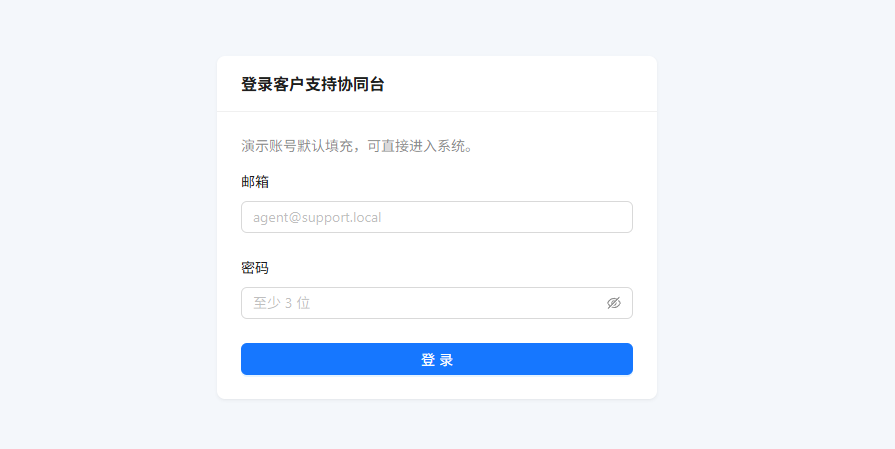
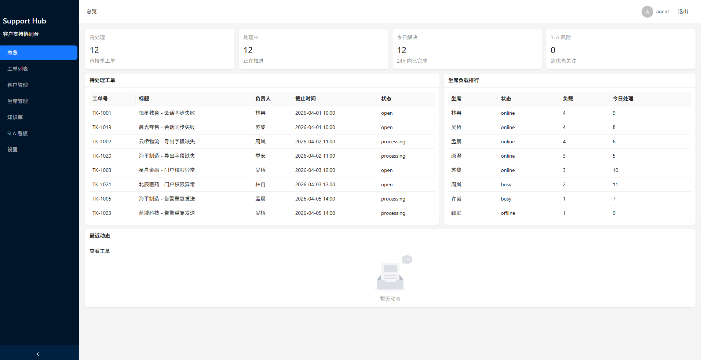
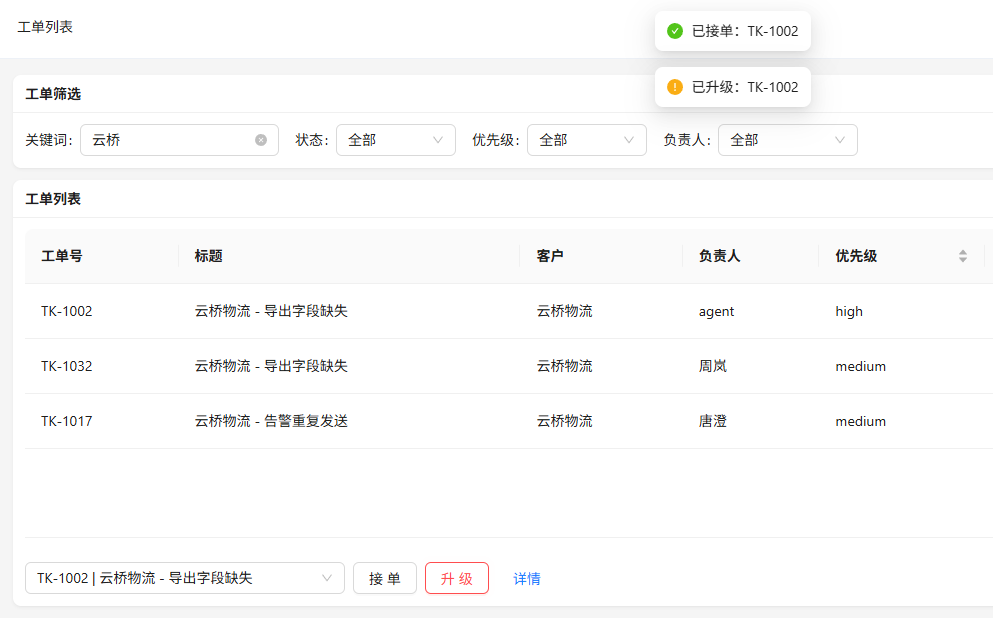
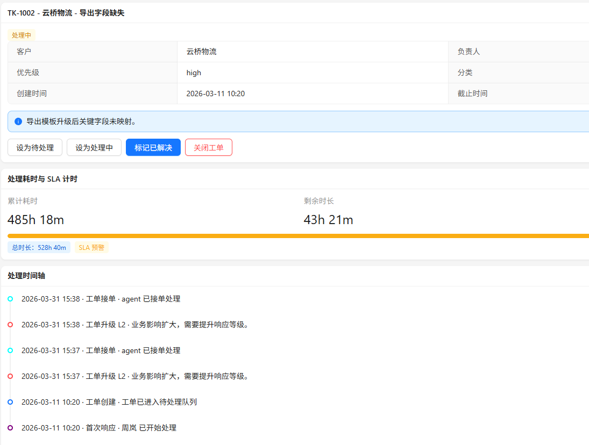
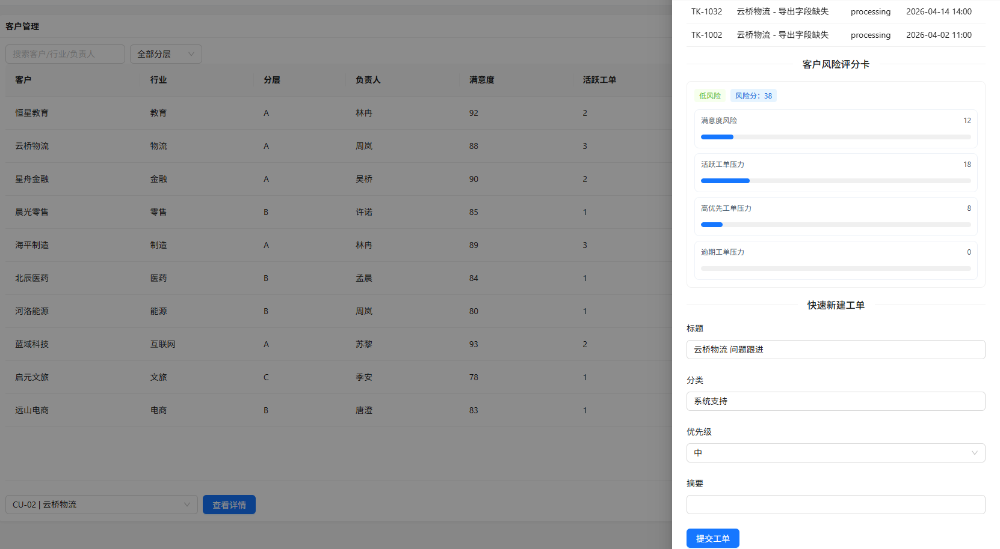
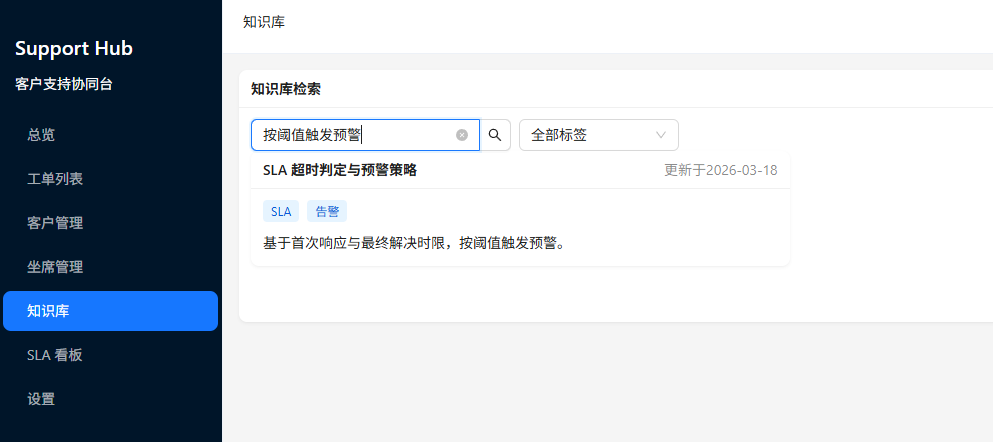

# 客户支持协同后台

客户支持协同后台 Vue + React 生态，混写项目迁移实战。

## 概述

这是一篇可跟练的迁移教程，目标是让你基于

`Vue + Vue Router + Ant Design (React) + Zustand (React)`，实现全生态释放，完成在真实业务场景下的 VuReact “可控混写” 迁移闭环。

### 在线演示

在开始之前，你可以提前访问本教程的 [在线演示](https://codesandbox.io/p/github/vureact-js/example-customer-support-hub/master?import=true) 进行 [预览](https://skx7pn-5173.csb.app/) 和体验。

### 视频演示

你也可以通过以下视频快速了解整个迁移过程：

<video muted controls>
  <source src="/static/demo_customer-support-hub.mp4" type="video/mp4" />
  您的浏览器不支持视频播放。
</video>

### 准备项

- Node.js 19+
- 已克隆 [customer-support-hub](https://github.com/vureact-js/example-customer-support-hub) 仓并安装依赖

## Step 1：准备示例与配置

### 1.1 命令

```bash
cd customer-support-hub
npm install
```

### 1.2 你会看到什么

- 依赖安装完成，项目目录中 `package.json` 可执行 `vr:watch` 与 `vr:build`。

```json
"scripts": {
  "vr:watch": "vureact watch",
  "vr:build": "vureact build"
}
```

- 根目录存在 `vureact.config.ts` 与 `src/`。

- 路由配置入口在 `vureact.config.ts` 中声明为 `src/router/index.ts`。

```ts
router: {
  configFile: 'src/router/index.ts',
},
```

### 1.3 失败时检查

- `npm` 命令不可用：检查 Node/npm 安装。
- 安装失败：优先清理锁文件冲突后重试。
- 不会解决：复制错误并求助于 AI。

### 1.4 通过标准

- `npm install` 无阻塞性错误。
- 能在根目录执行 `npm run vr:build`。

## Step 2：执行 VuReact 编译

### 2.1 命令

```bash
npm run vr:build
```

可选：增量迁移可使用监听模式。

```bash
npm run vr:watch
```

### 2.2 你会看到什么

- 控制台输出编译统计（SFC/script/style 处理数量）。



- 生成 `.vureact/react-app` 目录，且与 Vue 源结构一致。



- 编译成功后，会按 `vureact.config.ts` 配置自动处理 React 入口样式导入（由 `onSuccess` 钩子完成）。

```ts
{
  onSuccess: async () => {
    /*
      对 main.tsx 注入缺失的 styles/app.css 导入
    */
    const __dirname = path.dirname(fileURLToPath(import.meta.url));
    const entryFile = path.resolve(__dirname, './.vureact/react-app/src/main.tsx');
    const data = fs.readFileSync(entryFile, 'utf-8');
    const newData = data.replace('index.css', 'styles/app.css');
    fs.writeFileSync(entryFile, newData, 'utf-8');
  };
}
```

### 2.3 失败时检查

- Network/NPM 错误：检查当前是否联网。
- SFC 语法错误：先修复源 Vue 文件再编译。
- 产物目录缺失：确认在项目根目录执行命令，且 `vureact.config.ts` 存在。

### 2.4 通过标准

- 输出目录存在且包含 `src/main.tsx`、`src/router` 等 React 工程文件。
- 重新执行 `npm run vr:build` 可稳定复现产物。

## Step 3：观察产物路由

### 3.1 你会看到什么

- React 产物应用入口 `main.tsx` 统一由 `RouterProvider` 承载。

```tsx
createRoot(document.getElementById('root')!).render(
  <StrictMode>
    <RouterInstance.RouterProvider />
  </StrictMode>,
);
```

- 路由守卫会放行 `meta.public` 页面（如登录页），其余页面在无会话时跳转登录。

```ts
// react-app/src/router/index.ts
router.beforeEach((to, _from, next) => {
  if (to.meta.public) {
    next();
    return;
  }
  const session = appStore.getState().session;
  if (!session.user) {
    next({ name: 'login', query: { redirect: to.fullPath } });
    return;
  }
  next();
});
```

- 页面路由（如 Dashboard/Tickets/Customers/Agents/Knowledge/SLA/Settings）可被访问。



### 3.2 失败时检查

- 页面空白：通常是 `main.tsx` 仍直接渲染 `<App />`。
- 路由组件报错：检查 `router/index` 导出与 `routes` 导入是否正确。
- 登录后仍被重定向：检查会话读写逻辑是否正常（`localStorage` 与 store 同步）。

### 3.3 通过标准

- 启动后可访问登录页，登录后可正常切换业务路由，不出现全局白屏。

## Step 4：观察 Vue + Zustand

本节我们将从 Vue 源码视角出发，观察 zustand 的使用方式。

### 4.1 你会看到什么

- 状态集中在 `src/store/useAppStore.ts`，用 `zustand/vanilla` 创建 `appStore`

```ts
import { createStore } from 'zustand/vanilla';

// 核心：创建 store + 动作
export const appStore = createStore<AppState>((set) => ({...}));
```

- 需要关注的状态字段：`session`、`ticketFilters`、`slaConfig`、`activities`

```ts
{
  session: { ... },
  ticketFilters: { ... },
  slaConfig: { ... },
  activities: [],
}
```

- 需要关注的动作：`login/logout`、`setTicketFilters`、`setSlaConfig`、`appendActivity`

```ts
{
  login: (user) => set((state) => ({ ... })),
  setTicketFilters: (patch) => set((state) => ({ ... })),
  appendActivity: (text) => set((state) => ({ ... }))
  // ...
}
```

- 路由守卫从 store 读取 `session.user`；未登录会跳到登录页

```ts
// src/router/index.ts
import { appStore } from './store/useAppStore';

router.beforeEach((to, _from, next) => {
  // ...
  const session = appStore.getState().session;
  // ...
});
```

- 业务页面通过 `appStore.subscribe(...)` 或 `getState()` 触发筛选/刷新，从而驱动页面数据更新

```ts
// src/App.vue
appStore.subscribe((state) => {
  userName.value = state.session.user?.name || '访客';
});
```

### 4.2 失败时怎么查

- 登录后仍被重定向：优先检查 `router.beforeEach` 是否读取到 `session.user`
- 筛选不生效：优先检查页面是否订阅了 `ticketFilters`，以及点击筛选后是否调用 `setTicketFilters` 并刷新
- 活动流不更新：优先检查触发链路是否调用了 `appendActivity`

### 4.3 通过标准

- 你能明确对应出：`session -> 路由守卫`，`ticketFilters -> 页面列表刷新`，以及 `appendActivity -> 动态/活动流出现`

## Step 5：观察 Vue + Ant Design

本节我们将从 Vue 源码视角出发，观察 antd 的使用方式。

### 5.1 你会看到什么

- 工单处理主区：`AntTable` + `AntSelect` + `AntButton`（表格/筛选/接单/升级）

```vue
<!-- src/pages/TicketsList.vue -->
<AntTable
  :columns="columns"
  :data-source="rows"
  :pagination="pagination"
  row-key="id"
  :loading="loading"
  @change="onTableChange"
/>
...
```

- 客户详情：`AntDrawer`（抽屉）承载信息展示与“快捷建单”

```vue
<!-- src/pages/Customers.vue -->
<AntDrawer :open="drawerOpen" width="560" title="客户详情" @close="onCloseDrawer">
 ...
</AntDrawer>
```

- 客户风险展示：`AntDescriptions/AntTag/AntProgress`（画像趋势、风险分、风险因子进度条）

```vue
<!-- src/pages/Customers.vue -->
...
<AntProgress :percent="point.score" :stroke-color="point.color" :show-info="false" />
```

- SLA 看板：`AntRadioGroup + AntTable`（切换“全部/风险/已超时”筛选结果）

```vue
<!-- src/pages/SlaBoard.vue -->
<AntRadioGroup :value="riskFilter" @change="onFilterChange">
  ...
</AntRadioGroup>
...
```

- 验证方式：通过产物或源代码中定位到 `from 'antd'` 的组件导入，即可快速关联到对应页面区域

### 5.3 失败时怎么查

- 表格不显示/列不对：优先检查 `columns` 的 `dataIndex` 是否与 `rows` 字段匹配，`row-key` 是否仍是 `id`
- 选择器没反应：优先检查 `:value` 绑定字段与回调（如 `onActiveTicketChange`）是否正确
- 抽屉/表单不工作：优先检查抽屉 `open` 状态是否切换，提交动作是否调用了 mock-api（如建单）

### 5.4 通过标准

- 你在页面里能完成“筛选/接单/升级/建单”等关键交互，并且页面数据与状态更新能观察到变化

## Step 6：启动 React 产物

### 6.1 命令

在 `.vureact/react-app` 目录下：

```bash
npm run dev
```

### 6.2 你会看到什么

- Vite dev server 启动成功（默认本地端口）。
- 浏览器打开后进入登录页。



- 登录后进入客服协同主界面。



- 热更新可用：修改 Vue 源文件，React 产物页面同步更新。

在 `customer-support-hub` 根目录下：

```bash
npm run vr:watch
```

### 6.3 失败时检查

- 缺依赖：安装日志里补齐缺失包后重启。
- TS 报错：优先检查路由入口、运行时包导入和路径别名。
- Vite 报错：优先检查当前 Node.js 版本是否兼容。

### 6.4 通过标准

- React 产物可访问、可热更新、无阻塞性启动错误。

## Step 7：页面验收（业务闭环）

在运行中的页面手动验收以下路径。

### 7.1 你会看到什么

- 登录与守卫：未登录访问业务页会跳转登录，登录后可回跳目标页面。
- 工单列表与详情：可筛选/搜索工单，进入详情页后可查看时间线与 SLA 快照。



- 工单动作联动：执行接单、分配、升级、状态更新后，活动流会新增对应记录。



- SLA 看板联动：工单升级或临期后，看板风险状态同步变化；更新 SLA 配置后阈值即时生效。
- 客户页联动：可查看客户风险评分，并通过“快捷建单”生成新工单，随后在工单列表中可检索到。



- 知识库检索：按关键词或标签筛选文章，分页数据正常。



### 7.2 失败时检查

- 联动不触发：检查 `mock-api` 对应方法是否被页面调用（如 `claimTicket/escalateTicket/updateTicketStatus`）。
- 活动流不更新：检查 store 中 `appendActivity` 是否执行。
- 搜索结果异常：检查 Fuse.js 关键字字段与筛选条件是否冲突。

### 7.3 通过标准

- “工单动作 -> 活动流/SLA -> 仪表盘或看板”链路完整跑通。
- “客户建单 -> 工单列表检索 -> 详情处理”链路完整跑通。

## Step 8：就近排错（按症状）

### 8.1 命令

```bash
# 重新编译
npm run vr:build

# 重新启动产物
cd .vureact/react-app && npm run dev
```

或删除产物后重编译：

```bash
rm -rf .vureact
npm run vr:build
cd .vureact/react-app && npm install && npm run dev
```

### 8.2 你会看到什么

- 大多数问题可归类为：路由入口、依赖缺失、源文件语法、类型约束、版本不兼容。

### 8.3 失败时检查

- 路由空白：优先回看 Step 3 的路由接入检查项。
- 编译失败：回到报错文件，修源代码后重编译。
- 类型不通过：检查生成产物中路由/运行时包导入是否正确。
- watch 不同步：确认根目录 `npm run vr:watch` 正在运行。

### 8.4 通过标准

- 能在 10 分钟内定位并修复常见阻塞错误。

## 附录 A：命令速查

```bash
# Vue 示例目录
cd customer-support-hub
npm install
npm run vr:build

# React 产物目录
cd .vureact/react-app
npm install
npm run dev
```

## 附录 B：能力映射（本案例）

- 模板：覆盖常用指令和事件等
- 组件：`defineProps` / `defineEmits` / slot
- 脚本：`ref` / `computed` / `watch` 等
- UI库：`ant design` 全量使用布局、表格、表单等
- 状态：`zustand` store 跨页面状态管理
- 路由：`createRouter` / 守卫 / 嵌套路由 / 动态路由
- 样式：`scoped` / Sass 语法
- 业务：工单流转、SLA 风险、知识库检索、客户风险评分

## 附录 C：排错索引

- 路由空白页：先看 [路由适配指南](/guide/router-adaptation)
- 语法覆盖范围：看 [能力矩阵](/guide/capabilities-overview)
- 编译告警处理建议：看 [最佳实践](/guide/best-practices)
- 问题反馈：
  - [Compiler Issues](https://github.com/vureact-js/core/issues)
  - [Router Issues](https://github.com/vureact-js/vureact-router/issues)

## 附录 D：继续学习导航

完成本教程后，建议按以下顺序继续：

1. [CLI 指南](/guide/cli)：掌握 `build/watch`、输入范围与工程化命令用法。
2. [配置 API](/api/config)：系统理解 `input/exclude/output/router` 等核心配置项。
3. [编译约定](/guide/specification)：明确编译器的行为边界与代码约定，降低迁移偏差。
4. [最佳实践](/guide/best-practices)：建立可回滚、可验收、可扩展的迁移流程。
