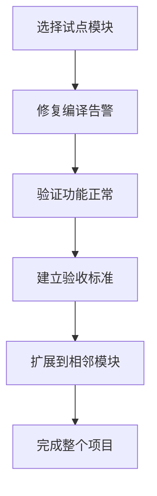

# 常见问题 (FAQ)

## Q1: 安装 VuReact 需要什么前提条件？

**A:** 需要满足以下条件：

- Node.js 18.0.0 或更高版本
- 现有的 Vue 3.x 项目（使用 `<script setup>` 语法）
- 包管理器：npm、yarn 或 pnpm

## Q2: 如何验证安装是否成功？

**A:** 运行以下命令检查版本：

```bash
npx vureact --version
```

如果显示版本号，说明安装成功。

## Q3: 配置文件应该放在哪里？

**A:** 配置文件 `vureact.config.js` 应该放在项目根目录，与 `package.json` 同级。

## Q4: 如何配置多环境（开发/生产）？

**A:** 可以在配置文件中使用环境变量：

```javascript
import { defineConfig } from '@vureact/compiler-core';

export default defineConfig({
  output: {
    outDir: process.env.NODE_ENV === 'production' ? 'react-app' : 'dev',
  },
  format: {
    enabled: process.env.NODE_ENV === 'production',
  },
});
```

## Q5: 为什么编译时报告 Hook 规则错误？

**A:** 这通常是因为 Vue 响应式 API 没有在顶层调用。请检查：

```vue
<!-- ❌ 错误示例：在条件语句中调用 -->
<script setup>
if (condition) {
  const count = ref(0); // 这里会报错
}
</script>

<!-- ✅ 正确示例：在顶层调用 -->
<script setup>
const count = ref(0); // 在顶层定义

if (condition) {
  // 这里可以使用 count
}
</script>
```

## Q6: 如何排除特定文件或目录？

**A:** 在配置中使用 `exclude` 选项：

```javascript
export default defineConfig({
  input: 'src',
  exclude: [
    'src/main.ts', // 排除入口文件
    'src/legacy/**', // 排除旧代码目录
    '**/*.test.vue', // 排除测试文件
  ],
});
```

## Q7: 编译后的文件在哪里？

**A:** 默认输出目录结构：

```txt
项目根目录/
├── .vureact/             # 工作区
│   ├── react-app/        # 生成的 React 代码
│   │   ├── src/          # 转换后的源代码
│   │   ├── package.json  # React 项目配置
│   │   └── vite.config.ts
│   └── cache/            # 编译缓存
└── src/                  # 原始 Vue 代码
```

## Q8: 如何清理编译缓存？

**A:** 删除工作区目录：

```bash
# 删除整个工作区
rm -rf .vureact

# 或只删除缓存
rm -rf .vureact/cache
```

## Q9: 如何不处理非 CSS 样式？

**A:** 添加编译器选项 `preprocessStyles: false`，原封不动的输出对应样式代码和文件

## Q10: 对非 CSS 样式关闭了预处理，为什么 scoped 没效果？

**A:** 目前暂不支持解析非 CSS 代码，因此忽略对 scoped 的处理

## Q11: 为什么不建议一次性全仓迁移？

**A:** 一次性迁移风险太高：

1. **难以验证**：大量代码同时转换，难以逐个验证正确性
2. **难以回滚**：出现问题需要回退整个迁移
3. **团队压力**：需要暂停业务开发进行迁移

**推荐做法：**



## Q12: 如何选择试点模块？

**A:** 选择试点模块的标准：

1. **边界清晰**：功能独立，依赖简单
2. **复杂度适中**：不是最简单的，也不是最复杂的
3. **业务价值**：有实际业务价值，能验证真实场景
4. **团队熟悉**：开发团队熟悉该模块的业务逻辑

## Q13: 迁移过程中如何继续业务开发？

**A:** 建议采用分支策略：

```txt
主分支 (main)
    ├── 继续业务开发
    └── 定期合并到迁移分支

迁移分支 (migration)
    ├── 进行 VuReact 转换
    ├── 验证功能正常
    └── 定期从主分支同步
```

## Q14: 生成的 React 代码性能如何？

**A:** VuReact 生成的代码经过优化：

1. **运行时开销小**：适配层经过精心设计，性能开销极小
2. **符合 React 最佳实践**：使用 `memo`、`useCallback` 等优化
3. **代码可读性好**：生成的代码清晰易读，便于后续优化

## Q15: 如何减少编译时间？

**A:** 可以采取以下措施：

1. **使用缓存**：VuReact 会自动缓存编译结果
2. **增量编译**：只编译修改的文件
3. **排除不需要的文件**：合理配置 `exclude` 选项
4. **分模块编译**：先编译核心模块，再逐步扩展

## Q16: 遇到编译错误怎么办？

**A:** 按以下步骤排查：

1. **查看错误信息**：错误信息会指出具体文件和行号
2. **检查代码约定**：确保代码符合 [编译约定](./specification)
3. **简化复现**：创建一个最小复现代码片段

## Q17: 如何报告 Bug？

**A:** 请提供以下信息：

1. **VuReact 版本**：`npx vureact --version`
2. **Node.js 版本**：`node --version`
3. **复现步骤**：详细描述如何复现问题
4. **错误信息**：完整的错误堆栈
5. **相关代码**：最小复现代码片段

可以在 [GitHub Issues](https://github.com/vureact-js/core/issues) 提交问题。

## Q18: VuReact 支持哪些 Vue 3 特性？

**A:** 完整支持 script setup、Composition API、defineProps/defineEmits/defineSlots、watch/computed 等核心特性。

## Q19: 转换后的性能如何？

**A:** 通过编译时优化和零运行时样式方案，转换后的 React 代码接近人类手写，且应用性能与原生 React 应用相当。

## Q20: 是否支持 Vue 2 或 Options API？

**A:** 当前版本专注于 Vue 3 + Composition API，不推荐用于 Vue 2 或 Options API 项目。

## Q21: 如何调试转换后的代码？

**A:** 因为是源码到源码级别的转换，因此正常运行 React 应用和调试即可。

## Q22: 为什么有些 Vue API 没有适配处理？

**A:** 编译器采用**针对性识别策略**，而非全量覆盖所有 Vue API：

1. 锁定范围机制：编译器维护一个**明确的 API 适配范围**，仅处理已知且已实现适配的 Vue API。

2. 选择性适配原则：
   - **核心 API 优先**：优先适配 Vue 3 的核心响应式 API 和生命周期钩子
   - **高频使用优先**：基于实际项目使用频率确定适配优先级
   - **语义可转换优先**：仅适配语义上可直接映射到 React 概念的 API

3. 未处理代码的处理方式：
   - **原样保留**：不在适配范围内的 Vue API 调用会原封不动地保留在输出代码中
   - **运行时兼容**：部分未处理 API 可能在 React 运行时环境中仍能工作（如纯工具函数）
   - **编译时告警**：对于明显不兼容的 API，编译器会发出警告提示

4. 扩展性设计：
   - **插件机制**：支持通过插件扩展 API 适配范围
   - **渐进适配**：可根据项目需求逐步增加新的 API 适配

## Q23: 有哪些常见的未处理 API 类型？

**A:** 常见未处理 API 类型包括：

| 类型               | 示例                          | 原因             | 建议                            |
| ------------------ | ----------------------------- | ---------------- | ------------------------------- |
| **Vue 2 遗留 API** | `$set`, `$delete` ...         | Vue 3 已废弃     | 迁移到 Vue 3 响应式 API         |
| **Vue 特定概念**   | `$parent`, `$children` ...    | React 无对应概念 | 使用 Context 或 Props 替代      |
| **复杂响应式工具** | `customRef`, `markRaw` ...    | 实现复杂度高     | 手动实现或使用 React 原生方案   |
| **生态系统特定**   | `$store` (Vuex), `$pinia` ... | 需特定运行时支持 | 直接使用对应的 React 状态管理库 |

## Q24: 对于未处理的 API 有什么处理策略建议？

**A:** 建议采取以下策略：

1. **代码审查**：在迁移过程中，重点关注未处理的 Vue API 调用
2. **渐进迁移**：先将核心逻辑迁移，再逐步处理边缘用例
3. **替代方案**：为未处理的 API 寻找 React 生态中的对应解决方案
4. **贡献扩展**：如有特定 API 适配需求，可通过插件机制扩展编译器能力

## Q25: 为什么生成的 React 组件名与 Vue 中的不一致？

**A:** 使用特殊注释 `// @vr-name: 组件名` 或 `defineOptions` 的 `name` 选项，显式告诉编译器组件名

## Q26: 如何处理 Vue 路由？

**A:** 路由转换提供了 [VuReact Router](https://router.vureact.top/guide/introduction.html) 适配包，编译器会处理，但入口配置等需要手动微调，因为：

1. **工程上下文**：路由配置涉及项目结构
2. **语法差异**：路由配置中的组件使用，需改用 JSX Element 写法

具体迁移指南请查看 [路由适配](./router-adaptation)。

## Q27: 支持 TypeScript 吗？

**A:** ✅ 完全支持 TypeScript。VuReact 会：

1. 保持原有的类型定义
2. 生成正确的 TypeScript 类型
3. 输出 `tsconfig.json` 配置

## Q28: 如何处理第三方 Vue 库？

**A:** 分情况处理：

1. **纯工具库**：通常可以直接使用
2. **UI 组件库**：需要寻找对应的 React 版本或替代方案
3. **Vue 特定库**：需要重写或寻找替代方案

建议在迁移前评估第三方库的替代方案。

## Q29: 可以自定义转换规则吗？

**A:** ✅ 支持通过插件系统自定义：

```javascript
export default defineConfig({
  plugins: {
    // 解析阶段插件
    parser: {
      // 自定义解析逻辑
    },
    // 转换阶段插件
    transformer: {
      // 自定义转换逻辑
    },
    // 代码生成阶段插件
    codegen: {
      // 自定义生成逻辑
    },
  },
});
```

## Q30: ESLint / TypeScript 报错怎么办？

**A:** 按以下步骤解决：

1. **报错原因**：`@vureact/runtime-core` 提供的适配 Hooks 可能与 ESLint 现有的 React Hook 规则不兼容。请注意，这些 Hooks 的内部实现完全遵循 React 规范，不影响实际运行。

2. **解决方案**：
   - **忽略报错**：可以安全地忽略这些 ESLint 警告。
   - **关闭检测**：在 ESLint 配置中关闭相关规则（如 `react-hooks/exhaustive-deps`）。
   - **TypeScript 编译**：如果运行 `tsc -b` 命令报错，建议改用其他构建命令（如 `vite build`）。

## Q31: 迁移完成后如何维护？

**A:** 迁移完成后：

1. **像普通 React 项目一样维护**：可以使用所有 React 生态工具
2. **可以继续优化**：可以手动优化生成的代码
3. **可以回退修改**：如果需要，可以直接编辑生成的 React 代码，但需避免被后续编译覆盖
4. **可以升级 VuReact**：新版本可能会提供更好的转换效果

## Q32: 访问路由导致报错怎么办？

**A:** 关于路由转换的常见问题，请参考 [路由适配章节的 FAQ](/guide/router-adaptation#常见问题)。

## Q33: 有社区或支持渠道吗？

**A:** 是的，可以通过以下渠道获取支持：

1. **GitHub Discussions**：技术讨论和问题解答 [GitHub Discussions](https://github.com/vureact-js/core/discussions)
2. **GitHub**：Bug 报告和功能请求 [GitHub Issues](https://github.com/vureact-js/core/issues)
3. **赞助**：支持作者！ [爱发电](https://afdian.com/a/vureact-js/plan)

## Q34: 如何解决 React 中 "Objects are not valid as a React child" 的问题？

**A:** 解决方案请移步 [路由适配指南](/guide/router-adaptation)，按照指南处理之后请重启 dev 服务。

## Q35: 启动 React 应用后，页面样式异常或丢失如何解决？

**A:** 请按以下步骤排查：

1. **检查样式文件导入**：确认 Vue 入口文件（如 `main.ts`）中是否导入了其他样式文件（如 `app.css` 或 `style.scss`）。若存在，请确保在生成的 React 入口文件（如 `main.tsx`）中保留相同的导入语句。
2. **检查文件后缀**：确认 React 入口文件（如 `main.tsx`）中导入的样式文件后缀为 `.css`，而非 `.scss` 或 `.less`，因为这些文件已被自动编译为 CSS 文件。
3. **检查编译配置**：确认 `vureact` 配置中未设置 `preprocessStyles: false`，否则样式代码可能未被正确处理。

---

**没有找到答案？** 请查看完整文档或提交新的问题 [GitHub Issues](https://github.com/vureact-js/core/issues)。
