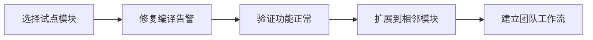

# 理念

VuReact 的设计遵循一系列核心原则，这些原则决定了它的行为边界和工程取向。理解这些理念有助于你更好地使用 VuReact，并在项目中做出合理的技术决策。

## 1. 可控性优先于全覆盖

**核心原则**：宁可明确拒绝不可分析的代码，也不生成不可维护的 React 产物。

### 这意味着什么？

- VuReact 会主动要求你的代码满足特定约定
- 当遇到无法静态分析的代码时，它会给出明确的告警或错误
- 转换质量优先于转换覆盖率

### 为什么这样设计？

React Hook 规则要求代码必须满足严格的静态分析条件。如果输入代码本身不可分析，任何转换工具都无法稳定生成符合规则的 React 代码。与其生成可能运行时崩溃的代码，不如在编译阶段就明确边界。

## 2. 推动现代 Web 跨框架开发

**愿景**：让 Vue 和 React 之间的迁移不再是"一次性重写"，而是可规划、可验证的工程流程。

### 传统迁移 vs VuReact 路径

| 维度         | 传统迁移方式               | VuReact 路径                       |
| ------------ | -------------------------- | ---------------------------------- |
| **转换策略** | 基于字符串替换的脚本       | 完整的编译流水线（解析→转换→生成） |
| **可预测性** | 结果难以预测，依赖人工验证 | 基于约定的确定性转换               |
| **可维护性** | 产物代码难以理解和维护     | 生成符合 React 最佳实践的代码      |
| **渐进能力** | 通常需要一次性完成         | 支持分模块、分阶段迁移             |

### 跨框架流动的四个支柱

1. **可分析**：输入代码必须能被静态分析
2. **可验证**：转换结果可以在 CI 中自动化验证
3. **可重复**：相同的输入始终产生相同的输出
4. **可扩展**：可以从小范围开始，逐步扩大迁移范围

现如今， Vue -> React 并不是什么新鲜概念，但 VuReact 想证明的是：只要建立清晰约定，Vue 与 React 之间可以形成稳定的工程流动路径。

## 3. 约定作为协作接口

**理念**：清晰的约定比复杂的运行时兜底更有价值。

### 约定的作用

- **降低认知成本**：团队对"什么能转、什么不能转"有共同理解
- **提高转换质量**：在约定边界内，转换结果更加稳定可靠
- **简化排障流程**：问题可以快速定位到具体的约定违反

### 约定的示例

- Vue 3 + `<script setup>` 语法
- 响应式 API 必须在顶层调用
- 模板表达式必须可静态分析
- 组件命名需要显式声明

## 4. 渐进式而非大爆炸

**迁移哲学**：通过可控的小步迭代，降低迁移风险。

### 推荐路径

### 关键实践

1. **先试点后推广**：从一个边界清晰的模块开始
2. **保持可回滚**：每一步迁移都设计回滚方案
3. **建立验收标准**：明确什么是"迁移完成"
4. **积累模式库**：将成功案例转化为团队知识

## 5. 编译时与运行时协同

**架构选择**：将复杂度合理分配到编译时和运行时。

### 编译时（Compiler）

- 语法转换：Vue SFC → React TSX
- 静态分析：验证代码是否符合约定
- 依赖管理：自动添加运行时依赖
- 代码优化：生成符合 React 最佳实践的代码

### 运行时（Runtime）

- 语义适配：提供 Vue 风格的 API（如 `useVRef`, `useComputed`）
- 行为兜底：处理框架间的细微差异
- 开发体验：提供调试工具和错误提示

### 协同优势

- **编译时保证正确性**：通过静态分析避免运行时错误
- **运行时提供灵活性**：在可控范围内提供 Vue 开发体验
- **两者结合实现工程化**：既不是纯字符串替换，也不是纯运行时解释

## 这些理念对你的意义

### 如果你是技术决策者

- 可以基于这些理念评估项目是否适合使用 VuReact
- 能够制定合理的迁移计划和期望管理
- 理解工具的限制和优势，做出明智的技术选型

### 如果你是开发者

- 知道为什么需要遵守特定约定
- 理解编译告警背后的设计考量
- 能够更高效地使用工具，减少试错成本

### 如果你是团队负责人

- 可以将这些理念转化为团队的工作规范
- 建立基于约定的代码评审标准
- 规划渐进式的技术演进路线
