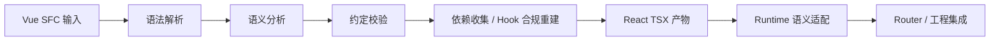

# 理念

VuReact 的设计并不是围绕“如何把 Vue 语法改写成 React 语法”展开的，而是围绕一个更核心的问题展开：**Vue 代码在 React 中应如何稳定成立。**

因此，VuReact 的目标不是成为可以处理任意历史代码的“万能转换器”，而是提供一条**可分析、可预测、可维护、可渐进落地**的跨框架工程路径。下面这些原则决定了 VuReact 的行为边界，也解释了它为什么会采用当前的 Compiler、Runtime 和 Router 协同架构。

## 1. 可控性优先于全覆盖

**原则**：宁可明确拒绝不可分析的代码，也不生成不可维护的 React 产物。

Vue 到 React 的迁移难点通常不在语法表面，而在响应式语义、生命周期、依赖关系和组件边界的重建。React Hook 规则要求生成结果必须满足严格的静态分析前提；如果输入代码本身不可分析，编译器就无法稳定生成符合规则的输出。

因此，VuReact 会主动要求输入代码满足明确约定，例如：

- 基于 Vue 3 和 `<script setup>`
- 响应式 API 在顶层调用
- 模板表达式可静态分析
- 组件边界声明清晰

这样设计的直接收益是：

- 问题会在编译阶段暴露，而不是在运行时才出现
- 团队可以明确区分“可迁移范围”和“需先整理的代码”
- 同类输入更容易得到一致输出，便于持续维护和自动化验证

## 2. 语义优先于语法

**原则**：转换的重点不是“长得像 React”，而是“在 React 中保持正确语义”。

VuReact 采用的是语义编译路线。它不会只根据语法形态做机械替换，而是先理解代码中的响应式来源、数据流方向、组件接口和依赖关系，再决定最终生成什么结构。

以 `ref` 为例，机械替换很容易得到“语法上像 React、语义上却已经变化”的结果：

```vue
<script setup lang="ts">
import { ref } from 'vue';

const count = ref(0);
const inc = () => count.value++;
</script>
```

如果只做表层替换，结果可能类似：

```tsx
const [count, setCount] = useState(0);
const inc = () => count++;
```

这并不能保留 Vue `ref` 的行为语义。VuReact 的重建目标更接近下面这种结构：

```tsx
const count = useVRef(0);
const inc = useCallback(() => {
  count.value++;
}, [count.value]);
```

这里的关键点不是 `ref` 被替换成了哪个 Hook，而是：

- `count` 被识别为响应式来源
- `inc` 被识别为顶层回调目标
- 回调中的依赖关系可以被收集和重建

这也是 VuReact 自动依赖分析的价值所在。它不是简单地“把变量放进依赖数组”，而是围绕明确的重建目标触发分析，再沿着引用链、别名和解构关系收集依赖，从而生成更稳定的 React 结构。

## 3. 约定作为协作接口

**原则**：清晰的约定比复杂的运行时兜底更有价值。

VuReact 的约定并不只是为了让编译器“更容易实现”，更重要的是让团队能够对迁移边界形成一致理解。对于跨框架迁移来说，约定本身就是一种协作接口：

- 开发者知道什么写法更稳定、更利于转换
- 评审者知道什么问题属于约定违规
- 团队可以把这些约定纳入代码评审和 CI 规则

例如，`defineProps`、`defineEmits`、`defineExpose` 在 Vue 中描述的是组件的输入、输出和暴露边界。VuReact 不会保留这些宏本身，而是会把它们重建为 React 中更自然的接口形式：

```vue
<script setup lang="ts">
const props = defineProps<{ title: string }>();
const emit = defineEmits<{ (e: 'save', id: number): void }>();
const count = ref(0);

defineExpose({ count });
</script>
```

对应的 React 形态通常会接近：

```tsx
type IComponentProps = {
  title: string;
  onSave?: (id: number) => void;
};

const Component = memo(
  forwardRef<any, IComponentProps>((props, expose) => {
    const count = useVRef(0);

    useImperativeHandle(expose, () => ({ count }));

    return null;
  }),
);
```

这里被保留的不是宏调用形式，而是组件边界语义：

- `defineProps` -> 输入契约
- `defineEmits` -> 输出回调协议
- `defineExpose` -> 暴露能力边界

## 4. 编译时与运行时协同

**原则**：能在编译期确定的，尽量在编译期完成；必须保留运行语义的，再交给 Runtime 适配。

VuReact 的整体处理链路可以概括为：



在这条链路里：

- **Compiler** 负责解析 Vue SFC、理解模板与脚本语义、校验约定、重建依赖型结构，并输出尽量贴近 React 工程实践的代码
- **Runtime** 负责提供 `useVRef`、`useComputed` 等语义适配能力，处理编译期无法完全抹平的框架差异
- **Router** 在需要时提供 Vue Router 风格的适配能力，使迁移路径可以扩展到完整工程

这种分层有三个目的：

- 将尽可能多的不确定性提前消化在编译阶段
- 将运行时职责限制在必要且有限的语义适配范围内
- 让生成产物保持原生 React 的可读性与可维护性

因此，VuReact 既不是纯字符串替换工具，也不是依赖大规模运行时解释的桥接方案。

## 5. 渐进式而非大爆炸

**原则**：迁移应当通过可控的小步迭代完成，而不是一次性重写。

VuReact 的推荐路径不是把整个 Vue 项目一次性“翻译”成 React，而是先建立一条稳定闭环，再按页面、目录或业务模块逐步扩展范围。这种方式更适合真实项目，也更利于团队协作。


渐进式迁移的价值主要体现在：

- 风险可以按模块切分，而不是集中爆发
- 每一步都可以定义验收标准和回滚方案
- 编译告警、修复方式和成功案例可以逐步沉淀为团队规范
- Vue 源码可以继续作为主维护对象，React 产物作为编译结果进行验证

这也是 VuReact 更适合进入工程工作流，而不仅仅是用来做一次性代码处理的原因。

## 6. 这些理念意味着什么

如果将以上原则放在一起看，VuReact 的定位会更清楚：

- 它关注的是**软件工程可控性**，而不只是语法层改写速度
- 它强调的是**语义重建**，而不只是代码表面映射
- 它提供的是**可验证的迁移路径**，而不只是一次性的转换结果

因此，VuReact 的价值首先体现在工程层面：帮助团队在跨框架演进中建立稳定边界、明确规则、控制风险，并持续产出可维护的 React 代码。
